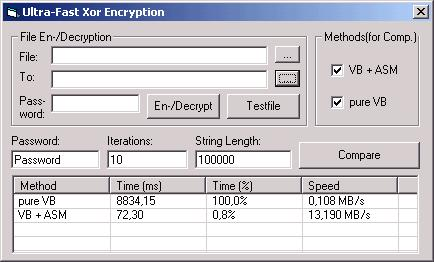



## Very Fast Xor Encryption \(10 MB/s with VB\+ASM\)

### Description

This project provides a class for xor encryption that can handle strings and files.

The class is over 100 times faster than normal vb-code, it encrypts with up to 13 MB/s!

VB does only about 0.1 MB/s, that means it encrypts a 10MB string in less than 1 second, where other routines posted on psc would take about 90 seconds!

You can also pass files to the class which will be encrypted with up to 6 MB/s!

(tested on a P-II 350)

How it works:

The class doesn't use any dlls, it all works with vb-code and a little bit assembler!

another advantage of this technique is that it has the same speed when it is used in the ide.

The sourcecode is commented, so i think you can also learn something about using asm in vb.

I hope you find it useful, thanks for your vote.
 
### More Info
 

             |
---                |---
**Submitted On**   |2002-11-07 21:36:58
**By**             |[Sven T\.](https://github.com/Planet-Source-Code/PSCIndex/blob/master/ByAuthor/sven-t.md)
**Level**          |Advanced
**User Rating**    |4.9 (64 globes from 13 users)
**Compatibility**  |VB 6\.0
**Category**       |[Encryption](https://github.com/Planet-Source-Code/PSCIndex/blob/master/ByCategory/encryption__1-48.md)
**World**          |[Visual Basic](https://github.com/Planet-Source-Code/PSCIndex/blob/master/ByWorld/visual-basic.md)
**Archive File**   |[Very\_Fast\_1493751182002\.zip](https://github.com/Planet-Source-Code/sven-t-very-fast-xor-encryption-10-mb-s-with-vb-asm__1-40515/archive/master.zip)

